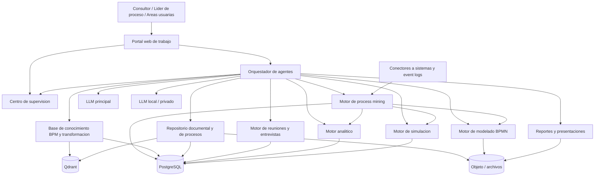

# Arquitectura inicial

## 1. Objetivo del sistema

Construir un agente IA especialista en procesos que pueda operar como copiloto autonomo de transformacion:

- aprende de una base documental amplia;
- entrevista a las areas;
- reconstruye procesos `as-is`;
- modela BPMN;
- propone mejoras;
- disena el `to-be`;
- simula escenarios;
- presenta resultados con trazabilidad y supervision.

No lo planteo como un solo "chatbot". Lo correcto es una plataforma multiagente con memoria, herramientas, aprobaciones humanas y gobierno de versiones.

## 2. Principios de arquitectura

1. `Autonomia supervisada`: el agente puede avanzar solo, pero toda accion critica debe quedar pausada para revision humana.
2. `Trazabilidad total`: cada hallazgo, pregunta, supuesto, version BPMN y recomendacion debe estar respaldado por fuentes o evidencia de reunion.
3. `Modelo primero`: el XML BPMN es un artefacto principal del sistema, no un simple adjunto.
4. `Separacion de capacidades`: ingestion, entrevistas, modelado, simulacion y supervision no deben vivir en un solo modulo opaco.
5. `Proveedor LLM intercambiable`: el sistema no debe depender de un solo proveedor.
6. `Privacidad por capas`: documentos sensibles y transcripciones deben poder procesarse localmente.

## 3. Esquema general



## 4. Modulos principales

### 4.1 Portal web

Debe concentrar:

- gestion de iniciativas de proceso;
- carga de libros, manuales, SOPs, politicas y actas;
- agenda de entrevistas;
- revision de transcripciones;
- editor BPMN embebido;
- panel de supuestos, hallazgos y riesgos;
- aprobaciones humanas;
- comparador `as-is` vs `to-be`;
- tablero de simulaciones y KPIs;
- exportacion de entregables.

### 4.2 Orquestador de agentes

Es el cerebro operativo del producto. Debe coordinar agentes especializados:

- `Agente de conocimiento`: indexa libros, glosarios, patrones BPM y reglas de modelado.
- `Agente levantador`: prepara entrevistas, hace preguntas, detecta vacios y contradicciones.
- `Agente modelador BPMN`: transforma narrativa operativa en BPMN y valida consistencia.
- `Agente analista`: identifica desperdicios, tiempos muertos, retrabajos, cuellos de botella y controles faltantes.
- `Agente de rediseno`: genera opciones `to-be`.
- `Agente simulador`: ejecuta escenarios y sensibilidad.
- `Agente redactor`: prepara informe ejecutivo, tecnico y presentacion final.
- `Agente supervisor`: decide cuando parar, pedir aprobacion o escalar a humano.

### 4.3 Centro de supervision

Este modulo no es opcional. Si el sistema sera autonomo, necesita un control visible.

Puntos de control obligatorios:

1. aprobacion del alcance del proceso;
2. validacion de la transcripcion y resumen de entrevistas;
3. aprobacion del BPMN `as-is`;
4. aprobacion de las hipotesis de mejora;
5. aprobacion de parametros de simulacion;
6. aprobacion del `to-be` final;
7. aprobacion antes de emitir entregables externos.

### 4.4 Base de conocimiento

Debe combinar:

- `RAG` sobre libros y documentos internos;
- reglas duras de BPMN;
- plantillas de patrones de proceso;
- taxonomia de capacidades, roles, eventos, SLA, riesgos, controles y sistemas;
- memoria de proyectos anteriores.

No basta con subir PDFs. Hay que convertir los documentos en unidades semanticas con metadatos: autor, tema, capitulo, pagina, concepto, patron, nivel de confianza y fecha.

Este sera tambien el espacio donde se alimenta al agente con los mas de 30 libros. La carga se hara mediante ingestion documental, embeddings y RAG, no pegando libros completos en prompts.

Machine learning aparece aqui en varias capas:

- embeddings para busqueda semantica;
- clasificacion de temas, riesgos, controles y patrones;
- extraccion estructurada de actividades y reglas;
- clustering de hallazgos o variantes;
- scoring de confianza y completitud;
- modelos predictivos futuros sobre tiempos, reprocesos o riesgos.

### 4.5 Repositorio documental y de procesos

Este modulo almacena los procesos disenados y toda su documentacion asociada. Debe funcionar como repositorio oficial de flujos, narrativas, evidencias y versiones aprobadas.

Responsabilidades:

- guardar BPMN XML `as-is` y `to-be`;
- guardar narrativa textual `as-is` y `to-be`;
- guardar diagramas renderizados;
- almacenar evidencias, actas, transcripciones, logs y reportes;
- controlar versiones de cada artefacto;
- comparar versiones de texto y BPMN;
- registrar aprobaciones y rechazos;
- bloquear versiones aprobadas;
- publicar paquetes documentales finales;
- permitir busqueda por proceso, actividad, sistema, rol, version o etiqueta.

Estados documentales:

```text
draft
in_review
changes_requested
approved
published
superseded
archived
rejected
```

Regla central:

- los agentes pueden crear borradores, pero solo una aprobacion humana puede publicar una version oficial.

### 4.6 Motor de reuniones y entrevistas

Debe operar por varios canales:

- reuniones sincronicas;
- formularios guiados asincronos;
- cuestionarios adaptativos;
- analisis de documentos ya existentes;
- consolidacion de contradicciones entre areas.

Flujo recomendado:

1. preparar agenda y mapa de stakeholders;
2. generar cuestionario por rol;
3. registrar audio o notas;
4. transcribir;
5. extraer actividades, eventos, reglas, excepciones, tiempos, sistemas, entradas y salidas;
6. construir un borrador narrativo del `as-is`;
7. devolver validacion a los participantes.

### 4.7 Motor de modelado BPMN

Responsabilidades:

- generar BPMN desde narrativa estructurada;
- editar BPMN visualmente;
- validar errores de modelado;
- versionar XML BPMN;
- comparar versiones;
- anotar cada tarea con evidencias, responsables, tiempos, sistemas y reglas.

### 4.8 Motor analitico

Debe producir analisis:

- `cuantitativo`: tiempos, frecuencias, capacidad, carga, espera, costo estimado, FTE, SLA;
- `cualitativo`: dolor del usuario, compliance, segregacion de funciones, dependencia manual, riesgo operativo, madurez digital;
- `comparativo`: `as-is` vs alternativas `to-be`;
- `causal`: por que ocurren retrabajos, atrasos o errores.

### 4.9 Motor de simulacion

Recomendacion:

- usar simulacion visual de tokens en la interfaz para explicacion y validacion rapida;
- usar simulacion discreta para escenarios cuantitativos serios.

Entradas tipicas:

- tiempo por actividad;
- distribuciones de llegada;
- capacidad por rol;
- calendarios;
- porcentajes de reproceso;
- reglas de enrutamiento;
- probabilidad de excepciones.

Salidas:

- lead time esperado;
- throughput;
- utilizacion por rol;
- colas;
- cuello de botella dominante;
- impacto de automatizar o redistribuir tareas.

### 4.10 Motor de process mining

Este modulo permite analizar el proceso desde datos reales de ejecucion. Es una pieza clave para que el agente no dependa solo de entrevistas.

Responsabilidades:

- importar event logs desde CSV, XES, OCEL o conectores futuros;
- validar calidad del log;
- mapear campos tecnicos a actividades de negocio;
- descubrir variantes del proceso;
- descubrir un modelo `as-is` basado en datos;
- comparar el comportamiento observado contra el BPMN aprobado;
- detectar desviaciones, reprocesos, cuellos de botella y esperas;
- generar parametros para simulacion;
- alimentar el analisis de mejora y el diseno `to-be`.

Event log minimo:

```text
case_id
activity
timestamp
```

Columnas recomendadas:

```text
resource
role
org_unit
system
lifecycle
cost
channel
amount
```

Motor recomendado:

- `PM4Py` como motor inicial open source en Python.
- adaptadores futuros para `Celonis`, `Apromore`, `SAP Signavio Process Intelligence` y `UiPath Process Mining`.

Relaciones clave:

- con `Motor de reuniones`: compara lo declarado por las areas contra lo que muestran los logs;
- con `Motor BPMN`: valida conformidad entre modelo y ejecucion real;
- con `Motor analitico`: aporta variantes, frecuencia, performance y desviaciones;
- con `Motor de simulacion`: aporta tiempos, distribuciones y tasas de reproceso.

## 5. Stack tecnico recomendado para el MVP serio

### Backend

- `Python`
- `FastAPI` para API y servicios
- `LangGraph` para orquestacion multiagente, persistencia y supervision humana
- `PostgreSQL` para estado, auditoria, configuracion, casos, entrevistas y versionado funcional
- `Redis` para colas, cache y trabajos
- `Qdrant` para recuperacion semantica
- almacenamiento de archivos en `MinIO` o filesystem gestionado
- versionado funcional de artefactos en repositorio documental
- `PM4Py` para process mining

### Frontend

- `React` con `TypeScript`
- `bpmn-js` para visualizar y editar diagramas BPMN
- complemento de simulacion visual con `bpmn-js-token-simulation`

### IA y documentos

- pipeline de ingestion con `Unstructured`
- embeddings locales cuando sea posible
- OCR si aparecen PDFs escaneados
- transcripcion de reuniones con `Whisper` local o servicio equivalente si se acepta nube

### Simulacion

- `SimPy` para simulacion discreta basada en eventos
- transformador de BPMN XML a grafo ejecutable de simulacion

### Process mining

- `PM4Py` para discovery, variantes, performance y conformance checking
- `pandas` para normalizacion y validacion de event logs
- soporte inicial CSV
- soporte posterior XES, OCEL y conectores SQL/ERP/CRM

## 6. Estrategia de LLM recomendada

### Opcion recomendada para arrancar

Usar una estrategia hibrida:

- `LLM principal gratuito en nube`: `Gemini 2.5 Flash-Lite` para tareas frecuentes de extraccion, clasificacion, cuestionarios, consolidacion y coordinacion general del agente.
- `LLM local / privado`: `Gemma 3` o `Qwen3` mediante `Ollama` para documentos sensibles, validaciones privadas y funcionamiento sin dependencia total de la nube.

### Por que esta mezcla tiene sentido

`Gemini 2.5 Flash-Lite` es hoy una buena opcion de arranque para un MVP porque Google mantiene una capa gratuita y publica limites gratuitos por modelo. Ademas, la familia Gemini 2.5 Flash ofrece contexto largo, salida estructurada y llamadas a funciones, lo que encaja bien con un agente orquestado.

El segundo modelo local evita dos problemas:

1. dependencia total de la cuota gratuita del proveedor;
2. exposicion innecesaria de documentos internos sensibles.

### Lo que no recomiendo

- depender solo de un LLM gratuito en nube para todo el producto;
- construir el sistema como un unico prompt gigante;
- intentar generar `as-is`, `to-be`, simulacion y presentacion final en una sola llamada;
- dejar que el agente edite BPMN sin checkpoints humanos.

## 7. Flujo operativo del producto

```text
1. Crear caso de proceso
2. Cargar conocimiento y documentos base
3. Identificar stakeholders y agenda
4. Ejecutar entrevistas y recopilar evidencia
5. Extraer narrativa estructurada del as-is
6. Generar BPMN preliminar
7. Validar as-is con las areas
8. Analizar cuellos de botella y oportunidades
9. Disenar opciones to-be
10. Simular escenarios
11. Consolidar recomendacion final
12. Obtener aprobacion humana
13. Emitir informe, BPMN final y presentacion
```

## 8. Modelo de datos minimo

Entidades base:

- `case`
- `process_scope`
- `process_repository`
- `process_artifact`
- `artifact_version`
- `version_diff`
- `stakeholder`
- `meeting`
- `transcript`
- `evidence`
- `process_fact`
- `assumption`
- `bpmn_version`
- `analysis_run`
- `simulation_run`
- `event_log`
- `process_event`
- `process_variant`
- `mining_run`
- `conformance_finding`
- `recommendation`
- `approval_task`
- `deliverable`

## 9. Riesgos clave que debemos contemplar desde el inicio

1. `Hallazgos inventados por el LLM`: se mitiga con citas, fuentes y aprobacion humana.
2. `BPMN sintacticamente bonito pero operativamente incorrecto`: se mitiga con validacion por area y reglas.
3. `Sobreuso de la capa gratuita`: se mitiga con cache, colas y modelo local de respaldo.
4. `Baja calidad de transcripcion`: se mitiga con revision humana y audio limpio.
5. `Simulaciones sin datos confiables`: se mitiga con rangos, supuestos versionados y analisis de sensibilidad.
6. `Crecimiento desordenado`: se mitiga separando orquestacion, conocimiento, modelado y supervision.

## 10. Lo que si hace falta implementar ademas

Si quieres un software realmente avanzado, ademas de la arquitectura hay que agregar estas capacidades:

1. `Gobierno del conocimiento`
   versionado de libros, reglas, prompts, plantillas y taxonomias.
2. `Marco de evaluacion`
   pruebas de exactitud para extraccion de procesos, calidad BPMN y calidad de recomendaciones.
3. `Seguridad`
   RBAC, cifrado, trazabilidad y aislamiento por cliente o unidad de negocio.
4. `Observabilidad`
   logs por agente, costos, tiempos, errores, calidad de respuesta y trazas de ejecucion.
5. `Motor de aprobaciones`
   para que el sistema sea autonomo, pero auditable.
6. `Biblioteca de patrones`
   onboarding, compras, facturacion, reclamos, atencion al cliente, aprobaciones, alta de proveedores y otros patrones comunes.
7. `Gestor de supuestos`
   indispensable para analisis cualitativo y simulacion seria.
8. `Exportacion profesional`
   BPMN XML, PDF, Word, PowerPoint y resumen ejecutivo.

## 11. Orden recomendado de construccion

### Fase 1

- ingestion documental;
- RAG;
- entrevistas asistidas;
- resumen estructurado del `as-is`.

### Fase 2

- generacion y edicion BPMN;
- validacion humana del `as-is`;
- analizador de mejoras.

### Fase 3

- generacion de `to-be`;
- simulacion discreta;
- tablero comparativo y entregables.

### Fase 4

- memoria organizacional;
- biblioteca de patrones;
- benchmarking entre procesos;
- semi automatizacion de rediseno.

## 12. Conclusion

La idea es totalmente viable, pero no debe construirse como un chatbot aislado. Debe nacer como una plataforma multiagente con:

- conocimiento estructurado;
- levantamiento guiado;
- BPMN como artefacto central;
- simulacion basada en datos;
- supervision humana obligatoria.

Esa es la diferencia entre una demo llamativa y un producto serio.
